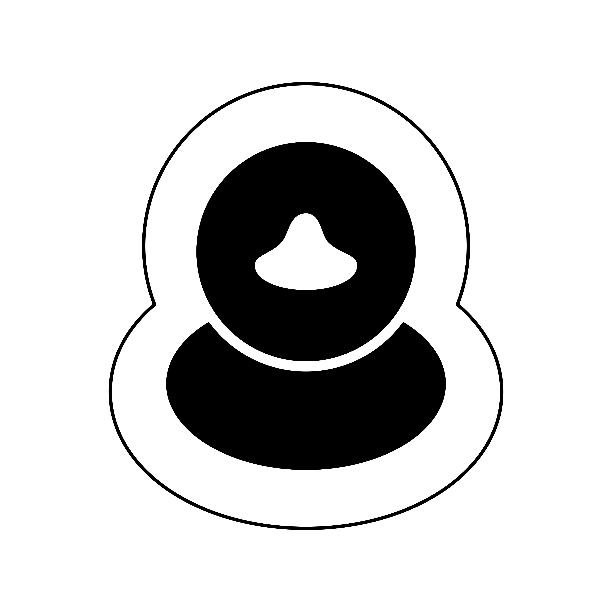

    
    

        <a href="./demo">Demo</a>
        <a href="./products">Products</a>
        <a href="./ideas">Ideas</a>
        <a href="./tutorials">Tutorials</a>
    

<h1>Qwack</h1>

3D printed **Jeep Wrangler Accessories** store.

    

         <h3>Rubber Duck Stand</h3>
        
    

    

        <h3>Car Key Hanger</h3>
        
    

    

        <h3>Grocery Bag Hanger</h3>
        
    

